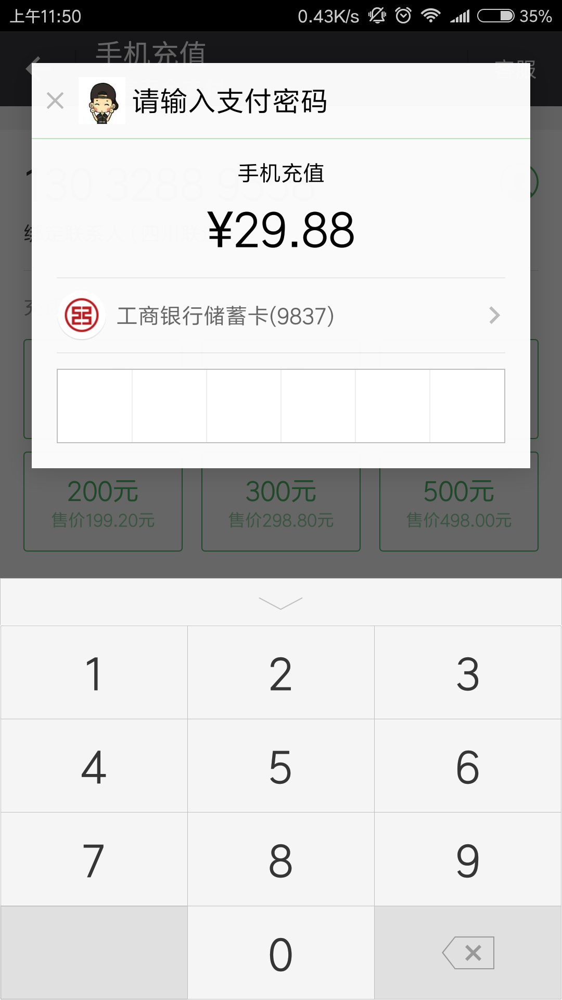
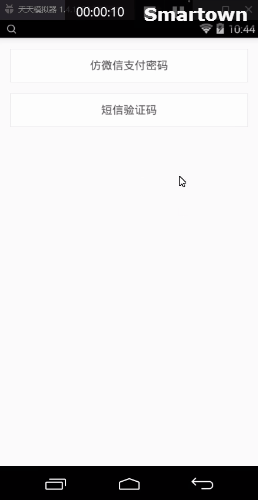

#仿微信支付密码
### GitHub（提供demo及library源码）
> [https://github.com/KungFuBrother/WeChatPwd](https://github.com/KungFuBrother/WeChatPwd)

### 项目简介
> 仿微信支付密码输入控件，包含数字密码输入键盘和密码显示控件两部分

### 实现功能
- 密码显示控件(CodeView)，开放部分属性，可自定义显示效果

        //密码长度，默认6位
        private int length;
        //描边颜色，默认#E1E1E1
        private int borderColor;
        //描边宽度，默认1px
        private float borderWidth;
        //分割线颜色，默认#E1E1E1
        private int dividerColor;
        //分割线宽度，默认1px
        private float dividerWidth;
        //默认文本，在XML设置后可预览效果
        private String code;
        //密码点颜色，默认#000000
        private int codeColor;
        //密码点半径，默认8dp
        private float pointRadius;
        //显示明文时的文字大小，默认unitWidth/2
        private float textSize;
        //显示类型，支持密码、明文，默认明文
        private int showType;

- 具体实现详见[GitHub](https://github.com/KungFuBrother/WeChatPwd)源码

### 效果展示
微信|密码输入|明文输入
---|---|---
||
